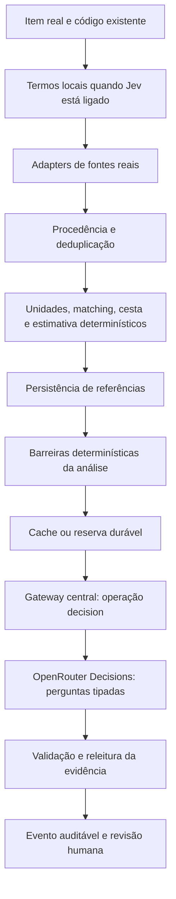

# Jev na Pesquisa de Preços — relatório de implementação e evidências

Data da revisão: 01/10/2026. Resultado: **NÃO APTO PARA AUDITORIA**.

Há uma integração de homologação, desligada por padrão, que registra decisões tipadas como propostas para revisão humana. Não há calibração rotulada, comparação A/B real ou evidência de redução de custo/tempo com precisão preservada. A implementação não autoriza aceitação automática pelo Jev. Este documento descreve o código e distingue evidência estática, testes com mocks e medições reais; nenhum dado ausente foi estimado.

## 1. HEAD inicial

`c55ba4d60125a886ff72c44abb51f8846deb5a52`. O HEAD foi conferido com `git rev-parse HEAD`. A análise inicial usa o estado desse commit como baseline; a implementação foi revisada também no working tree da branch, ainda em alteração durante a elaboração deste relatório.

## 2. Branch e limites operacionais

`feature/jev-price-research`, conferida com `git branch --show-current`. Sem merge, deploy, ativação em produção, alteração de credenciais ou aplicação de migration de produção. A flag existente `price_research` permanece independente da nova flag.

## 3. Arquitetura encontrada: antes e depois

O módulo existente usa `execucao.py` para lotes reentrantes no Streamlit; adapters de Compras.gov/PNCP fornecem referências; `modelo.py` confere procedência e deduplica; `unidades.py` normaliza; `matching.py` ranqueia; `estatistica.py` seleciona cesta e calcula estimativas com Decimal. `repositorio.py` persiste referências, estados e eventos. `semantica.py` trata IA como proposta, valida ações/IDs/hashes e mantém textos externos como dados não confiáveis. `llm.py`, `ai_gateway.py` e `roteamento.py` já concentram credenciais, finalidade, seleção de motores e registros de geração.

Antes, o caminho automático de pesquisa podia usar a LLM generativa para sugerir termos, seguido de coleta e cálculo determinísticos. Com Jev habilitado, o fluxo substitui essa expansão por tokens presentes na descrição, mantém os adapters e todos os cálculos e acrescenta uma análise tipada sobre referências já persistidas. Não existe um segundo módulo de pesquisa nem um gateway financeiro independente.

Limite do desenho atual: a análise Jev ocorre depois de `pesquisar_item` calcular a estimativa determinística. É um piloto observacional. O funil barra registros inelegíveis e dispensa o HTTP quando catálogo/código e descrição integral normalizada são idênticos; os demais elegíveis podem seguir ao Jev. Ainda não está homologada uma alteração do ranking/cesta guiada por thresholds calibrados. Essa restrição evita promover um limiar arbitrário, mas impede declarar o fluxo final plenamente homologado.

O Cartographer não estava disponível entre as ferramentas desta revisão; foram usados busca e leitura direta dos módulos conhecidos, conforme o fallback previsto em `CLAUDE.md`. Não houve revisão jurídica das regras normativas.

## 4. Locais alterados

| Arquivo | Papel |
|---|---|
| `src/precos/jev.py` | Transporte HTTP Decisions e validação estrita do retorno |
| `src/precos/decisoes.py` | State mínimo, perguntas, barreiras, cache, reserva, releitura e revisão |
| `src/ai_gateway.py` | Operação `decision`, autorização contextual, limites e telemetria |
| `src/llm.py` | Registro central com uso explícito e metadados de decisão |
| `src/roteamento.py` | Distinção entre decisão e geração; modelo Jev pinado |
| `src/governanca.py` | Constante de flag Jev independente |
| `src/precos/repositorio.py` | Contexto autorizado e leitura dos eventos usados como cache |
| `src/precos/execucao.py` | Termos locais e callback de análise após persistência |
| `src/precos/semantica.py` | Finalidade explícita para o fallback generativo existente |
| `src/ui/precos_ui.py` | Ativação conforme flag e apresentação administrativa para revisão |
| `requirements.txt` | `httpx==0.28.1`, sem SDK de decisão adicional |
| `scripts/jev_benchmark.py` | Comparação offline de artefatos, sem rede |
| `tests/test_precos_jev.py`, `tests/test_precos_decisoes.py`, `tests/test_jev_benchmark.py` | Contrato, proteções e benchmark sem inventar dados |
| `docs/jev/` | Dataset candidato, instruções de rotulagem e este relatório |

Não houve refatoração dos módulos estatísticos nem dos adapters oficiais. A verificação de regressão completa deve conferir também os caminhos existentes de geração e flag OFF.

## 5. Adapter Jev

`jev.decidir` envia `model`, `state` e `questions` via httpx, desabilita redirects e retorna `Resultado`. A validação rejeita envelope/campos inesperados, perguntas ausentes, tipo incorreto, opção fora da allowlist, distribuição incompleta/inválida, números não finitos, score incompatível com a distribuição/rubrica, modelo inesperado e usage inválido. Erros possuem códigos controlados; corpo HTTP, chave e state não são interpolados na mensagem de erro.

Timeout não é repetido automaticamente porque a chamada pode ter sido faturada sem resposta conhecida. HTTP 429 e 5xx possuem retries limitados com backoff. HTTP 401, JSON inválido e erros de schema seguem para revisão. Essa política não prova faturamento zero das tentativas sem resposta; os custos desconhecidos são registrados como desconhecidos.

## 6. Integração OpenRouter

Endpoint configurado no adapter: `https://openrouter.ai/api/alpha/decisions`, usando `Bearer` no servidor. A credencial vem de `llm.obter_openrouter_key()` e do mecanismo existente de `OPENROUTER_API_KEY`; não foi criado segredo Jev, painel de chaves ou autenticação paralela. Nenhuma credencial foi lida, registrada ou incluída em fixture para esta revisão.

O gateway faz uma operação tipada própria, sem fingir Chat Completions e sem atravessar a `base_url` de chat do OmniRoute. Revalida flag, tenant, cadeia pesquisa → item → referência, raw_hash, state e perguntas antes do HTTP. O acesso reutiliza o cliente autenticado do repositório.

Modelo solicitado: `typesafe/jev-1.13`. `JEV_MODEL` diferente dessa versão é recusado pela configuração atual; não há uso de `~typesafe/jev-latest`. A resposta conserva o modelo/snapshot informado e rejeita versões não pertencentes ao prefixo permitido.

## 7. Fluxo final implementado

Flag OFF: `_opcoes_triagem()` retorna vazio e o motor semântico anterior permanece disponível. Flag ON: `_motor_semantico()` retorna None, `execucao` usa termos determinísticos e chama `decisoes.revisar_item` após persistir as referências. O Jev não coleta fontes nem cria preço, contrato, fornecedor, URL, unidade ou código.

As barreiras da análise conferem IDs, fonte registrada/tipo, hash do bruto, preço original positivo e finito, natureza do valor, unidade normalizada compatível, data válida dentro da janela e código de catálogo coerente. Referências barradas geram evento de revisão sem HTTP. Depois das barreiras, identidade exata de tipo/código de catálogo e descrição integral normalizada gera `deterministic_match` sem chamada; não usa tokenização que perderia números curtos e não autoriza aceitação automática. A proposta aceita pelo schema é relida contra a evidência vigente e as barreiras são reaplicadas depois do HTTP; falha mantém revisão humana. Referências originais e descartadas permanecem consultáveis.

A seleção de catálogo é opcional quando o item não tem código. As opções vêm de códigos/descrições presentes em referências oficiais persistidas, com hash conferido, e incluem `none`. Isso não é uma nova busca de descrições oficiais do catálogo; homologar a qualidade dessas opções continua pendente. A escolha não escreve o código no item.

## 8. Perguntas Noul/Choice/Score

| Finalidade | Tipo | Retorno aceito |
|---|---|---|
| `price_reference_comparability` | noul | Probabilidade escalar entre 0 e 1 |
| `price_reference_mismatch` | choice | `compatible`, `different_product`, `different_specification`, `different_unit`, `different_packaging`, `insufficient_information`; confidence e probabilities |
| `price_reference_semantic_score` | score | Expectativa entre 0 e 4, confidence, probabilities e legend conferida |
| `catalog_candidate_selection` | choice | Somente candidatos fornecidos ou `none` |

As três primeiras perguntas compartilham uma única chamada e o mesmo state de referência. Noul não exige `confidence` separado: o seu valor já é uma probabilidade. As perguntas tratam descrições externas como dados e pedem que o modelo não pressuponha especificações ausentes. Isso reduz superfície de instrução, mas a resistência comportamental contra prompt injection ainda precisa de casos reais.

## 9. Versão do schema

`VERSAO_PERGUNTAS = "price-reference-v1"`. O hash inclui o conteúdo completo das perguntas além da versão, do modelo e do state; alterar critérios também invalida o cache. O schema do dataset é `jev-calibration-candidates-v1`.

## 10. Política de confiança

Toda decisão do Jev permanece `status=manual_review` e `automatic_acceptance=False`, inclusive resultados aparentemente confiantes. A dispensa determinística por identidade exata recebe `deterministic_match`, também sem aceitação automática pelo novo componente. Confidence/probabilities são preservados na resposta auditável, sem conversão em aprovação automática. A UI usa frases derivadas dos motivos tipados e avisa que a análise está em calibração. `analise_atual` confere state inteiro, conjunto de candidatos quando aplicável, modelo, versão e hash das perguntas antes da exibição.

## 11. Dataset de calibração

`dataset_candidatos.json` possui cinco pares extraídos de `tests/fixtures/precos/compras_precos_praticados.json`. Ambos os lados apontam arquivo, SHA-256 do arquivo, índice e raw_hash canônico. Todos têm `human_label=null`. Os registros são alicates wattímetro do mesmo catálogo; não há cobertura rotulada de negativos, ambiguidades, embalagem/unidade, tamanho, potência ou escopo de serviço diferentes.

Logo, é um conjunto de candidatos com proveniência verificável, ainda não um dataset calibrado. `dataset.md` orienta revisão humana das fontes e proíbe interpretar null como negativo. É necessário ampliar o corpus com evidências reais e introduzir explicitamente a classe ambígua na política/runner se ela participar da homologação.

## 12. Thresholds encontrados

**Nenhum threshold Jev foi calibrado ou promovido.** Os pisos já existentes do matching/estatística determinísticos não são thresholds Jev. Não foi estabelecida faixa de alta confiança; o risco prioritário continua aceitar uma referência materialmente diferente.

## 13. Precision/recall

Não medidos. False positives, false negatives e matriz de confusão também não medidos. O runner só emite métricas quando todo o recorte solicitado contém rótulos humanos e respostas registradas nos dois pipelines. Concordância com a IA anterior não substitui rótulo humano.

## 14. Cache e reentrância

Chave: hash de tenant, pesquisa_id, item_id, state completo, modelo, versão e perguntas. O state contém raw_hash e IDs da referência. O cache reutiliza o payload de `pesquisa_preco_eventos`, consulta por tenant/pesquisa/item/chave e valida novamente o retorno tipado. Não há cache global compartilhado entre tenants.

Antes de sair para HTTP, uma reserva com `jev:claim:<hash>` usa o índice UNIQUE `(pesquisa_id, idempotency_key)` já existente na migration `0021_pesquisa_precos.sql`; resultado usa `jev:result:<hash>`. A reserva evita nova chamada em rerun, duplo clique e concorrência entre abas/processos quando a persistência e esse índice estiverem disponíveis. Reserva sem resultado encaminha à revisão e não é repetida silenciosamente. É uma escolha conservadora: recuperar uma chamada interrompida exige procedimento explícito, ainda pendente de homologação operacional. Não houve teste de banco real ou navegação interativa desses eventos nesta revisão.

## 15. Fallback

`JEV_FAILURE_MODE` default `HUMAN_REVIEW`. `LLM_FALLBACK` pode usar `semantica.py` e a finalidade de geração existente somente para explicação após falha de transporte/HTTP. O fallback não aceita referências, não altera cesta/código e passa pela validação anterior de ação/ID/hash. Falha de schema ou decisão stale não dispara geração para mascarar a falha.

Na indisponibilidade de Jev, a coleta, normalização, matching e estatística determinísticos continuam. As falhas da análise são registradas para revisão, sem decisão inventada.

## 16. Telemetria e auditoria

O gateway chama `llm.registrar_geracao` uma vez por operação, reutilizando log, histórico de sessão e `geracoes`. Registra tenant, secretaria quando disponível, processo, pesquisa, item, referência, provider, modelo solicitado/retornado, finalidade, raw_hash/state_hash, versão, tokens, cost em USD, timestamp, latência e tentativas. O evento da pesquisa conserva answers, probabilities, confidence quando aplicável, usage e hashes; não registra chain of thought.

Cache hit não gera novo lançamento financeiro. A decisão persistida informa cache_hit no retorno ao consumidor; não há chamada ao provider nesse caminho. Custos das tentativas anteriores sem usage não são estimados: `cost_scope=reported_successful_response_only`, `usage_status=unknown` em falha, e `prior_attempts_usage=unknown` após sucesso com retry.

Limites: `db.registrar_geracao_bd` é best-effort e pode degradar sem a coluna `roteamento`, perdendo metadados/custo centrais em schema antigo. A trilha da pesquisa é o registro adicional da decisão, mas falha de persistência exige revisão. O gateway anterior não fornece enforcement de orçamento financeiro nem circuit breaker; reusar seus registros não equivale a implementar esses controles. Validar a persistência multi-tenant e a retenção/consulta de custos num banco de homologação continua pendente.

## 17. Custo

Não medido. Nenhuma chamada paga à API real foi realizada nesta bateria, pois não havia credencial local disponível para esse teste. Isso não constitui evidência de custo unitário zero em uso real. `usage.cost` dos mocks valida somente o transporte/registro do campo, nunca um preço comercial ou economia observada.

## 18. Latência

Não medida em API real ou A/B. Configuração default: `JEV_TIMEOUT=20`, `JEV_MAX_RETRIES=1`, `JEV_CONCURRENCY=2`; limites configuráveis validados pelo servidor. O semáforo limita chamadas por processo, não globalmente entre workers. As referências são analisadas sequencialmente dentro do item; as perguntas do mesmo state são agrupadas. Não foi presumido batching arbitrário de referências nem demonstrado ganho de velocidade.

O tempo registrado originalmente por `pesquisar_item` cobre a etapa determinística antes do callback Jev. A latência total de A/B deve ser medida externamente sobre o lote completo; somar apenas esse tempo interno omite a análise posterior.

## 19. Benchmark 1/10/50/210 e tabela ANTES/DEPOIS

`scripts/jev_benchmark.py` é offline: recebe dataset e artefatos baseline/Jev já gravados, confere proveniência e produz os recortes. Não chama API nem preenche respostas faltantes. Os cinco candidatos não suportam os recortes de 10/50/210 nem precisão de qualquer recorte sem rotulagem.

| Tamanho solicitado | Candidatos disponíveis no recorte | Rótulos humanos | A/B real | Custo/tempo/tokens/precisão |
|---:|---:|---|---|---|
| 1 | 1 | Pendente | Não executado | Não medidos |
| 10 | 5 | Pendentes | Não executado | Não medidos |
| 50 | 5 | Pendentes | Não executado | Não medidos |
| 210 | 5 | Pendentes | Não executado | Não medidos |

| Indicador | ANTES: pipeline existente | DEPOIS: piloto com Jev |
|---|---|---|
| Custo total/por item | Não medido no mesmo corpus | Não medido |
| Tempo médio por item/total | Não medido no mesmo corpus | Não medido |
| Chamadas LLM generativa | Quantidade real não medida; expansão de termos possível | Quantidade real não medida; termos locais por default e fallback explicativo opt-in |
| Chamadas Jev | Zero por desenho do baseline | Quantidade em operação real não medida; zero chamadas reais nesta bateria |
| Tokens de entrada/saída | Não medidos | Não medidos |
| Precision/recall | Não medidos contra rótulo humano | Não medidos contra rótulo humano |
| False positives/false negatives | Não medidos | Não medidos |
| Itens enviados à revisão humana | Quantidade real não medida | Quantidade real não medida; todas as decisões Jev permanecem propostas para revisão |
| Rastreabilidade | Referências, bruto/raw_hash e eventos existentes | Mesma trilha acrescida de decisões tipadas, usage e hashes; persistência real ainda não ensaiada |

## 20. Regressões e testes

Inspeção estática: cálculos de preço, Decimal e adapters preservados; flag OFF não introduz o callback Jev; código não promove resultado do modelo à cesta. A checagem de sintaxe foi informada como concluída pela coordenação. Dependências runtime foram instaladas e a suíte completa estava em execução durante esta revisão; seu resultado final deve ser inserido abaixo antes de encerrar a entrega.

**Validação local em 01/10/2026:** 88 testes dirigidos aprovados em 4,14 s (adapter, decisões, gateway, benchmark e regressão de llm/roteamento). A primeira execução completa de `pytest -q tests` terminou com 2.456 aprovados, 329 pulados e 4 falhas em 315,96 s. As quatro falhas eram de ambiente: subprocessos sem Streamlit no caminho padrão e PyYAML ausente. Após criar ambiente virtual e instalar PyYAML, os 12 testes dos grupos afetados passaram em 4,74 s. Não se apresenta essa sequência como uma execução completa sem falhas.

Ambiente: Python 3.12.14 no Windows; CI usa Python 3.11/Linux. Foram necessários UTF-8 e um ajuste exclusivamente no bootstrap local para diretórios temporários do Python herdarem as permissões do workspace, sem alterar código de produto para contornar o ambiente. Os skips incluem provas que exigem PostgreSQL/pgvector ou LibreOffice ausentes; não provam isolamento nem renderização institucional.

Os testes adicionados cobrem contrato Noul/Choice/Score, modelo/usage, resposta inválida, HTTP/JSON, timeout/retry, barreiras, flag OFF, cache/reserva, state stale, fallback explicativo e proveniência/ausência de métricas. Mocks demonstram contratos locais; não demonstram calibração, comportamento do modelo real, RLS real ou performance de 210 itens.

## 21. Riscos

- A API é alpha e o parser estrito pode recusar futuras mudanças de contrato; isso encaminha à revisão, mas precisa de acompanhamento e teste real versionado.
- Nenhum corpus adversarial/rotulado comprova precisão ou resistência comportamental contra descrições com instruções maliciosas.
- A triagem das referências elegíveis que não comprovam identidade exata e a execução sequencial podem aumentar o tempo total; não há prova de menor custo/latência.
- Reserva durável evita duplicidade e também impede reenvio automático após falha/crash com resultado desconhecido; operação de recuperação precisa ser documentada.
- Retry em 429/5xx pode acarretar custo adicional não reportado; a telemetria não soma usage que o servidor não forneceu.
- Orçamento/circuit breaker e limite global entre workers não estão comprovados pela integração atual.
- Os achados de invalidação encontrados nesta revisão foram corrigidos no código: UI recompõe state/candidatos/modelo/schema/perguntas e a releitura pós-HTTP reaplica as barreiras. A execução dos testes dessa correção ainda precisa ser consolidada; leitura do código não equivale a uma bateria runtime aprovada.
- Persistência central best-effort não garante retention integral de custo/metadados em um banco sem as colunas existentes necessárias.

## 22. Pendências e decisão

1. Concluir execução runtime/regressão e registrar resultados exatos, incluindo as correções dos achados de invalidação.
2. Rotular manualmente pares reais comparáveis/não comparáveis/ambíguos e ampliar cenários difíceis, sem inventar evidências.
3. Executar bateria pequena real e gravar usage.cost, tokens, latência e modelo/snapshot retornados, sem expor a chave.
4. Escolher thresholds com análise de falso positivo, separar calibração/validação e documentar política de confiança; manter aceitação automática desligada até essa evidência existir.
5. Executar A/B no mesmo corpus para 1/10/50/210 itens e comprovar menor custo, tempo menor ou igual, precisão preservada e rastreabilidade.
6. Ensaiar cache durável, dupla aba/rerun, falha/crash, recuperação, isolamento entre tenants e persistência de custos no ambiente de homologação.
7. Definir enforcement de orçamento/circuit breaker e concorrência global conforme a arquitetura central, sem criar ledger paralelo.
8. Homologar seleção de catálogo a partir de candidatos reais, o funil dos casos duvidosos e a UI com estados stale e motivos contraditórios.

**NÃO APTO PARA AUDITORIA.** O protótipo pode seguir em revisão e homologação com flag OFF; a ausência de calibração e benchmark real impede declarar cumprimento dos critérios finais ou ganhos econômicos. Nenhuma aprovação de merge, deploy, migration ou produção é inferida deste relatório.
